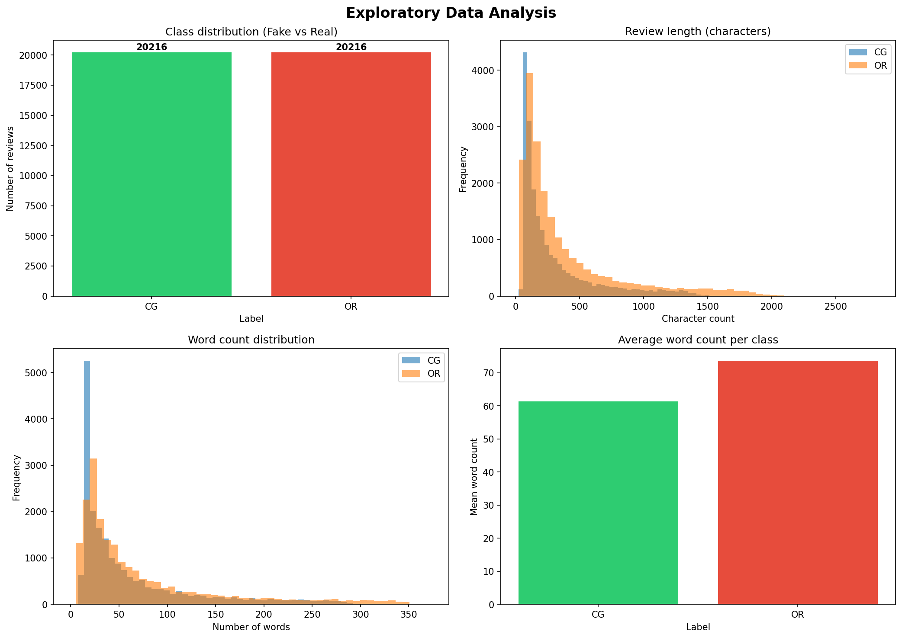
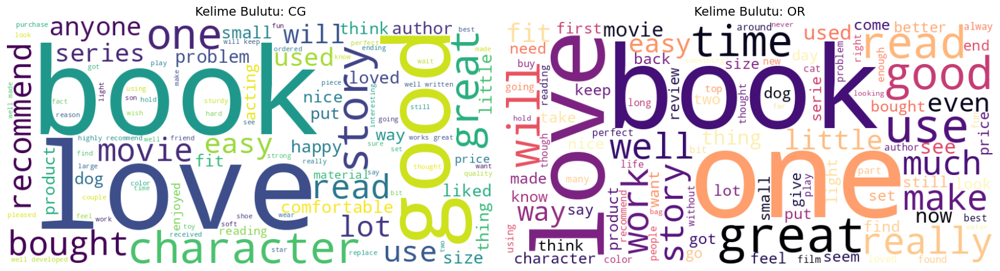
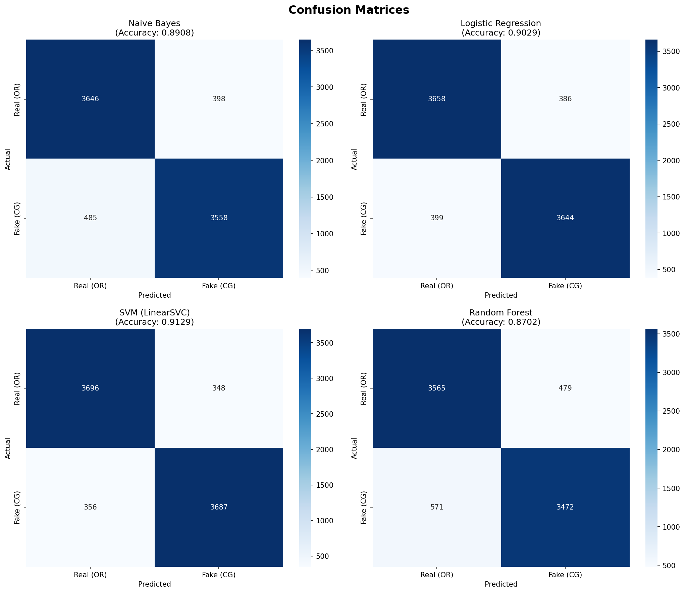
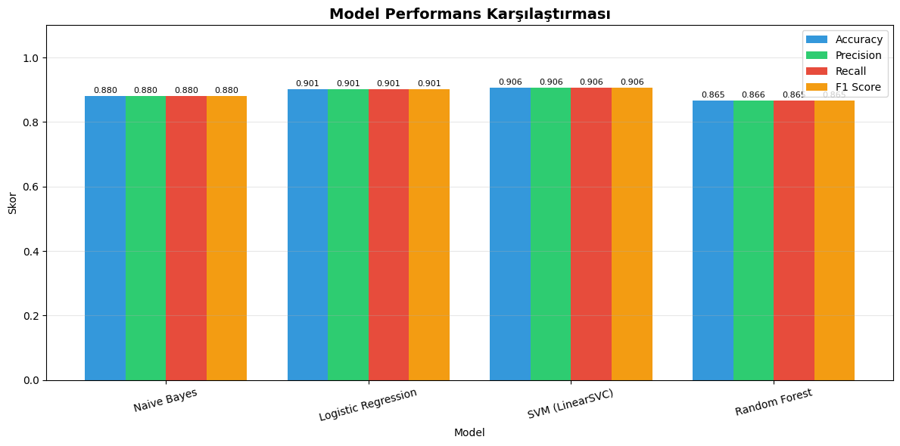
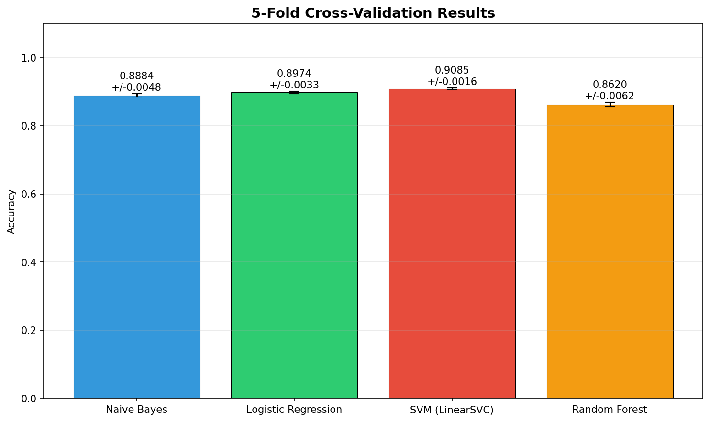

# 🔍 Fake Reviews & Opinion Spam Detection using Machine Learning

[](https://python.org)
[](https://scikit-learn.org)
[](https://www.nltk.org)
[](https://opensource.org/licenses/MIT)

A machine learning pipeline that detects fake (computer-generated) product reviews with **90.59% accuracy** using NLP preprocessing and TF-IDF feature extraction. Four classifiers are compared: Naive Bayes, Logistic Regression, SVM, and Random Forest.

> 📄 **Undergraduate Thesis Project** — Software Engineering Department

---

## 📊 Results at a Glance

| Model | Accuracy | F1 Score | CV Mean (±Std) |
|-------|----------|----------|----------------|
| **SVM (LinearSVC)** | **90.59%** | **0.9059** | **0.8999 (±0.0033)** |
| Logistic Regression | 90.13% | 0.9013 | 0.8949 (±0.0045) |
| Naive Bayes | 87.98% | 0.8798 | 0.8750 (±0.0034) |
| Random Forest | 86.55% | 0.8655 | 0.8579 (±0.0058) |

## 🔬 Project Overview

### Problem
Online fake reviews mislead consumers and distort e-commerce markets. Manual detection is impractical at scale — automated ML-based detection is essential.

### Approach
```
Raw Reviews → NLP Preprocessing → TF-IDF Vectorization → ML Classification → Evaluation
```

### Key Findings
- **SVM outperforms** all other models, consistent with literature (Ott et al., 2011; Joachims, 1998)
- **Random Forest underperforms** on sparse TF-IDF matrices due to feature subsampling limitations
- **5-fold cross-validation** confirms no overfitting across all models
- Bigram features (ngram_range=(1,2)) capture phrase-level patterns missed by unigrams alone

---

## 📁 Dataset

**[Kaggle Fake Reviews Dataset](https://www.kaggle.com/datasets/mexwell/fake-reviews-dataset)** — 40,432 product reviews:
- 20,216 **genuine** (human-written, labeled `OR`)
- 20,216 **fake** (computer-generated, labeled `CG`)
- Categories: Home & Kitchen, Clothing, Electronics, etc.
- Perfectly balanced — no class imbalance handling needed

---

## 🛠️ Pipeline Details

### 1. Text Preprocessing
- Lowercasing
- URL & HTML tag removal (regex)
- Number & punctuation removal
- Stop-word removal (NLTK English stopwords)
- Lemmatization (WordNet Lemmatizer)

### 2. Feature Extraction (TF-IDF)
| Parameter | Value | Rationale |
|-----------|-------|-----------|
| `max_features` | 10,000 | Top 10K most informative terms |
| `ngram_range` | (1, 2) | Unigrams + bigrams |
| `max_df` | 0.95 | Remove terms in >95% of docs |
| `min_df` | 2 | Remove terms in <2 docs |
| `sublinear_tf` | True | Logarithmic TF scaling |

### 3. Train/Test Split
- 80% training (32,344 reviews) / 20% test (8,087 reviews)
- Stratified sampling to preserve class balance
- TF-IDF fitted on training set only (no data leakage)

### 4. Models & Hyperparameters
| Model | Key Parameters |
|-------|---------------|
| MultinomialNB | alpha=1.0 |
| LogisticRegression | C=1.0, max_iter=1000 |
| LinearSVC | C=1.0, max_iter=2000 |
| RandomForest | n_estimators=200, n_jobs=-1 |

---

## 📈 Visualizations

### EDA — Class Distribution & Review Length Analysis


### Word Clouds — Fake vs Real Reviews


### Confusion Matrices


### Model Performance Comparison


### 5-Fold Cross-Validation Results


---

## 🚀 Quick Start

### Prerequisites
```bash
pip install pandas scikit-learn nltk matplotlib seaborn wordcloud
```

### Run
```bash
# 1. Download dataset from Kaggle and place CSV in project root
# 2. Run the pipeline
python fake_review_detector.py
```

### Google Colab
You can also run this directly in Google Colab:
1. Upload the notebook to Colab
2. Mount Google Drive: `drive.mount('/content/drive')`
3. Upload the dataset CSV
4. Run all cells

---

## 🏗️ Project Structure
```
fake-review-detection/
├── fake_review_detector.py    # Main pipeline script
├── README.md                  # This file
├── requirements.txt           # Python dependencies
├── results/                   # Generated plots and tables
│   ├── 01_eda_analizi.png
│   ├── 02_kelime_bulutu.png
│   ├── 03_confusion_matrices.png
│   ├── 04_model_karsilastirma.png
│   ├── 05_cross_validation.png
│   └── 06_sonuc_tablosu.csv
└── docs/                      # Thesis report (Turkish)
    └── tez_raporu.docx
```

---

## 📚 Key References

- Jindal, N. & Liu, B. (2008). *Opinion Spam and Analysis.* WSDM '08. [DOI](https://doi.org/10.1145/1341531.1341560)
- Ott, M. et al. (2011). *Finding Deceptive Opinion Spam by Any Stretch of the Imagination.* ACL 2011. [arXiv](https://arxiv.org/abs/1107.4557)
- Joachims, T. (1998). *Text Categorization with SVMs.* ECML-98. [DOI](https://doi.org/10.1007/BFb0026683)
- Mohawesh, R. et al. (2021). *Fake Reviews Detection: A Survey.* IEEE Access. [DOI](https://doi.org/10.1109/ACCESS.2021.3075573)
- Pedregosa, F. et al. (2011). *Scikit-learn: Machine Learning in Python.* JMLR, 12, 2825–2830.

---

## 🧰 Tech Stack

- **Language:** Python 3.12
- **ML Framework:** scikit-learn
- **NLP:** NLTK (tokenization, lemmatization, stopwords)
- **Feature Extraction:** TF-IDF (sklearn)
- **Visualization:** Matplotlib, Seaborn, WordCloud
- **Environment:** Google Colaboratory (Intel Xeon 2.20GHz, 2 vCPU, 12GB RAM)

---

## 📝 License

This project is licensed under the MIT License — see the [LICENSE](LICENSE) file for details.

---

## 👤 Author

Murat Ay
- 🎓 Software Engineering, Istinye University
- 📧 murat.3d.02@hotmail.com
- 💼 https://www.linkedin.com/in/murat-ay-47a259377/
